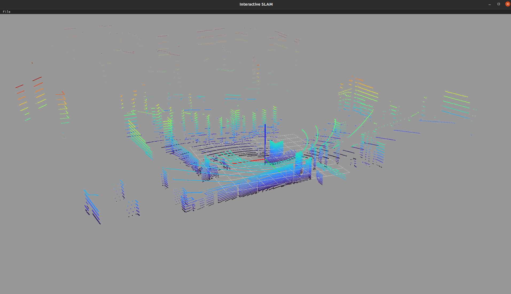

# Interactive Point Cloud

The `interactive-point-cloud` is a utility project that support development of software that deals with 3D data. The interactive-point-cloud focus to handle semantic data labeled in point cloud data. This tool is able to used to draw or modify semantic data in a user-defined data structure.  



## How to build and run  

```
git clone https://github.com/harderthan/interactive-point-cloud.git ${REPOSITORY_DIR}
```

#### docker  

```bash
cd ${REPOSITORY_DIR}/docker/
source build.sh
source run.sh
```

### from sources  

```bash
mkdir -p ${REPOSITORY_DIR}/build
cd ${REPOSITORY_DIR}/build
cmake .. && make && ./interative_point_cloud
```